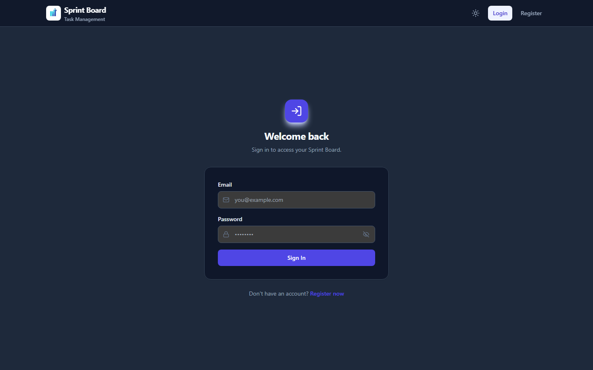
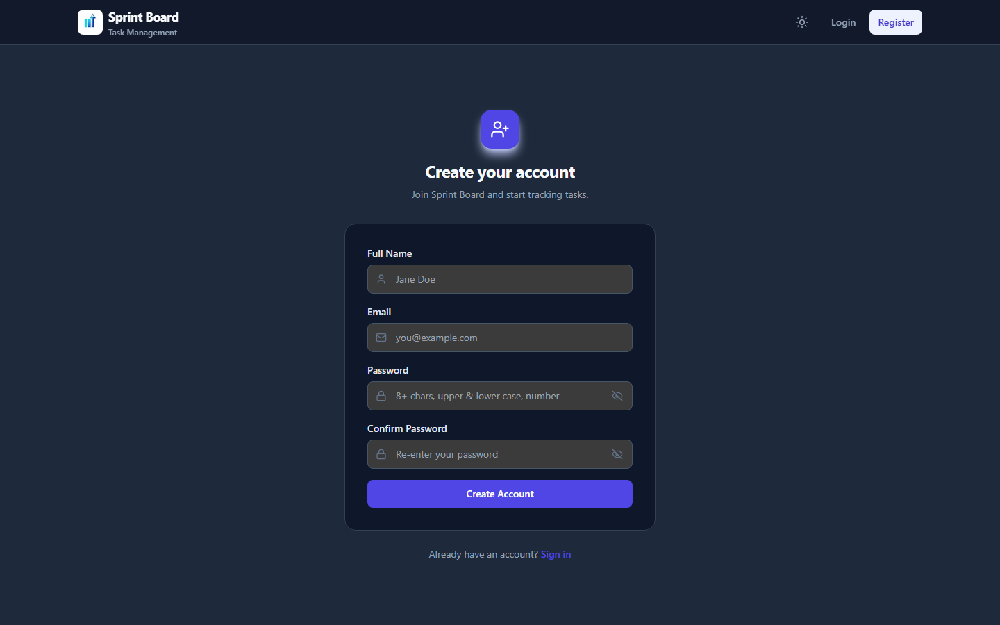
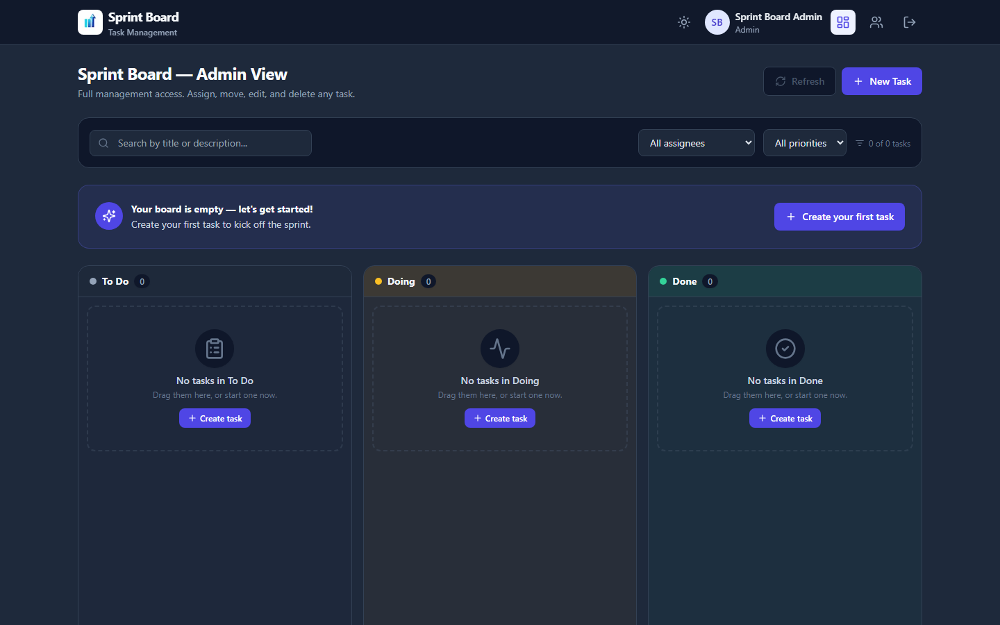
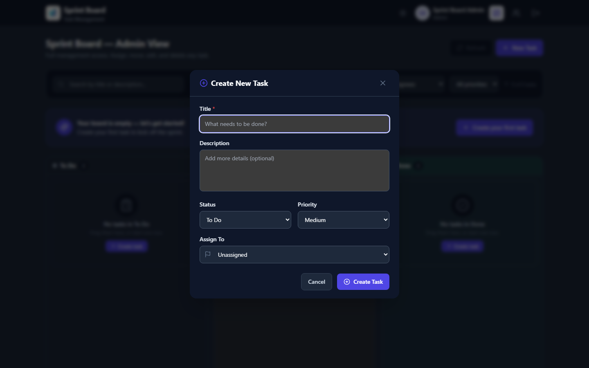

# Sprint Board — Full-Stack Task Management

A production-ready, Trello-like kanban task management application with strict **Role-Based Access Control (RBAC)**. Built as a decoupled dual-folder monorepo with a TypeScript Express REST API and a Next.js 14 (App Router) frontend.


[]()
[]()
[]()

---

## Table of Contents

1. [Project Overview](#project-overview)
2. [Application Screenshots](#application-screenshots)
3. [Architecture](#architecture)
4. [Technology Stack & Justifications](#technology-stack--justifications)
5. [Role-Based Access Control](#role-based-access-control)
6. [Directory Structure](#directory-structure)
7. [Local Development Setup](#local-development-setup)
8. [Environment Configuration](#environment-configuration)
9. [API Endpoint Specification](#api-endpoint-specification)
10. [Security & Hardening](#security--hardening)
11. [Deployment](#deployment)
12. [Submission Block](#submission-block)

---

## Project Overview

Sprint Board is a team task management application where **all users can view every task** across three kanban columns ("To Do", "Doing", "Done"), enabling team visibility and self-assignment of open work. Normal users manage their own created/assigned tasks, while administrators have global control over assignment, editing, moving, and deletion.

**Core features:**

- Public registration/login with JWT sessions and a dedicated admin seeded via `npm run seed`
- Three-column kanban board with **drag-and-drop** task moves (`@hello-pangea/dnd`)
- Task creation with title, description, and `low`/`medium`/`high` priority
- Self-claim of any unassigned task; admins can assign/unassign anyone to any task
- Team **Users directory** (admin-only) for assignee pickers
- Task search/filter, per-column filter counts, and toast notifications
- Dark/light theme toggle and password visibility toggle on auth forms
- Backend-enforced **Role-Based Access Control**, sanitization, and security headers

---

## Application Screenshots

| Login | Register |
|---|---|
|  |  |

| Kanban Board (dashboard) | Create Task modal |
|---|---|
|  |  |

Screenshots were captured from the application's production build under real team-visible data.

---

## Architecture

The project uses a **strictly decoupled dual-folder monorepo**:

- **`/backend`** — A self-contained REST API (Express + TypeScript + Mongoose). Can be deployed independently (Render/Railway).
- **`/frontend`** — A self-contained Next.js 14 application (App Router + Tailwind CSS). Communicates with the backend exclusively via the REST API over HTTP. Can be deployed independently (Vercel).

```
┌──────────────┐   HTTPS / JSON    ┌──────────────┐
│   Frontend   │ ────────────────▶ │   Backend    │
│  Next.js 14  │   Axios + JWT    │  Express API  │
│   App Router │ ◀──────────────── │   MongoDB    │
└──────────────┘   JSON responses  └──────────────┘
```

Key decoupling principles:

- The frontend never touches the database directly; all persistence flows through the typed REST API.
- The backend is UI-agnostic and fully testable via `/api` endpoints.
- Authentication state is carried via a **JWT Bearer token** persisted in `localStorage` and attached by an Axios request interceptor.
- Backend-enforced RBAC means UI gating is a UX convenience, not a security boundary.

---

## Technology Stack & Justifications

### Backend

| Technology | Justification |
|---|---|
| **Node.js + Express 4** | Mature, lightweight, battle-tested web framework with a massive ecosystem. The de-facto standard for REST APIs. |
| **TypeScript** | Static typing catches class of bugs at compile time, improves maintainability, and documents the API contract for the rich Mongoose models and RBAC logic. |
| **MongoDB + Mongoose ODM** | Flexible document model perfectly suited to the variable shape of tasks (assignee/deliverable availability); Mongoose enforces schema validation, typing, and population of user references. Indexes on `status`, `assignedTo`, and `createdBy` keep board queries fast. |
| **JSON Web Tokens (jsonwebtoken)** | Stateless authentication — no server-side session store required, scales horizontally on Render/Railway for free. |
| **bcryptjs** | Password hashing with salt rounds; pure-JS implementation avoids native build issues across deployment platforms. Password is stripped from all API responses via schema `transform`. |
| **Express middleware chain** | `protect` (JWT verification) → `adminOnly` (role guard) → controllers → centralized error handler produce clean, consistent JSON error responses. |

### Frontend

| Technology | Justification |
|---|---|
| **Next.js 14 (App Router)** | Server components, file-based routing with route groups, built-in CSS support, and first-class Vercel deployment. The `(auth)` route group cleanly separates public auth pages from the protected dashboard. |
| **Tailwind CSS** | Utility-first styling that keeps components consistent, responsive, and free of bespoke CSS files. |
| **@hello-pangea/dnd** | Actively maintained fork of `react-beautiful-dnd` with strict-mode/React 18 support and an accessible, polished drag-and-drop UX. Loaded dynamically (`ssr: false`) to avoid SSR compatibility issues. |
| **Lucide React** | Lightweight, consistent icon set for actions and status indicators. |
| **Axios** | Interceptor-based JWT attachment, unified error handling, and clean typed JSON responses. |
| **React Context** | `AuthContext` provider centralizes user state, token persistence, and auth actions across the app with zero prop-drilling. |

---

## Role-Based Access Control

### Board Visibility

| Role | View All Tasks |
|---|---|
| **user** | ✅ Yes — full team visibility across "To Do", "Doing", "Done" |
| **admin** | ✅ Yes |

### Normal User (`user`)

| Action | Allowed |
|---|---|
| Register & login via public routes | ✅ |
| Create tasks (default status `To Do`) | ✅ |
| Assign an **unassigned** task to **themselves only** | ✅ |
| Assign tasks to other users | ❌ Rejected by backend (HTTP 403) |
| Edit / delete / move tasks they **created** | ✅ |
| Edit / delete / move tasks **assigned to themselves** | ✅ |
| Modify tasks assigned to other users | ❌ Rejected by backend (HTTP 403) |

### Administrator (`admin`)

| Action | Allowed |
|---|---|
| **No public registration** — role sanitization forces any client-supplied role to `user` | ✅ Enforced in backend |
| Provisioned **only** via `npm run seed` | ✅ |
| Assign / reassign / unassign **any** task to **any** user or `null` | ✅ |
| Edit, move, delete **any** task | ✅ |
| Fetch the user directory (`GET /api/users`) | ✅ |

---

## Directory Structure

```
sprint-board/
├── README.md
├── screenshots/                     # README application screenshots (PNG)
├── TESTING.md                       # Phase 1–4 manual + automated test matrix
├── backend/
│   ├── package.json
│   ├── tsconfig.json
│   ├── .env.example
│   ├── render.yaml                  # Render Blueprint (build + env)
│   └── src/
│       ├── config/
│       │   └── db.ts                # MongoDB connection + reconnect handling
│       ├── models/
│       │   ├── User.ts              # User schema + bcrypt pre-save hook
│       │   └── Task.ts              # Task schema + status enum + indexes
│       ├── middleware/
│       │   ├── auth.ts              # JWT verify → req.user
│       │   ├── role.ts              # adminOnly guard
│       │   ├── rateLimiter.ts       # register limiter (3/hour/IP)
│       │   └── error.ts             # Centralized JSON error handler
│       ├── controllers/
│       │   ├── authController.ts    # register, login, me
│       │   ├── userController.ts    # getAllUsers (admin only)
│       │   └── taskController.ts    # Full CRUD + status + assign (RBAC)
│       ├── routes/
│       │   ├── authRoutes.ts
│       │   ├── userRoutes.ts
│       │   └── taskRoutes.ts
│       ├── utils/
│       │   └── passwordPolicy.ts    # Server-side password strength check
│       ├── scripts/
│       │   └── seedAdmin.ts         # Idempotent admin account seeder
│       └── server.ts                # Express bootstrap + helmet/CORS
│
└── frontend/
    ├── package.json
    ├── next.config.js             # "/" → "/dashboard" redirect
    ├── tailwind.config.ts
    ├── postcss.config.js
    ├── tsconfig.json
    ├── vercel.json                # /api/* rewrite proxy + headers
    ├── .env.local.example
    ├── lib/
    │   ├── api.ts                 # Axios client + JWT interceptor + types
    │   └── utils.ts               # Date/initial helpers
    ├── context/
    │   ├── AuthContext.tsx        # Auth provider + useAuth hook
    │   ├── ThemeContext.tsx       # Dark/light theme provider
    │   └── ToastContext.tsx       # Toast notifier provider
    ├── components/
    │   ├── AuthProvider.tsx       # Default-export wrappers
    │   ├── Navbar.tsx
    │   ├── KanbanBoard.tsx        # DragDropContext, state, API calls
    │   ├── TaskColumn.tsx         # Droppable column + filters
    │   ├── TaskCard.tsx           # Draggable card + RBAC controls
    │   ├── CreateTaskModal.tsx
    │   ├── ConfirmDialog.tsx
    │   ├── UsersDirectory.tsx     # Admin team directory
    │   ├── PasswordInput.tsx       # Password field with eye toggle
    │   ├── ThemeProvider.tsx
    │   └── ToastProvider.tsx
    └── app/
        ├── globals.css
        ├── layout.tsx             # Root layout → AuthProvider
        ├── page.tsx               # Redirect → /dashboard
        ├── (auth)/
        │   ├── login/page.tsx
        │   └── register/page.tsx
        └── dashboard/
            ├── page.tsx           # Dynamic (no-SSR) KanbanBoard
            └── users/page.tsx     # Admin-only Users directory
```

---

## Local Development Setup

### Prerequisites

- Node.js **18+** (tested on 22)
- npm **10+**
- A MongoDB instance — local `mongod`, Docker, or a free **MongoDB Atlas** cluster

### 1. Backend Setup

```bash
cd backend
npm install

# Create your environment file
cp .env.example .env
```

Edit `.env`:

```env
PORT=5000
MONGODB_URI=mongodb+srv://<username>:<password>@<cluster>.mongodb.net/sprint-board?retryWrites=true&w=majority
JWT_SECRET=a_long_random_secret_string
JWT_EXPIRES_IN=7d
```

Seed the administrator account (add `ADMIN_EMAIL` / `ADMIN_PASSWORD` to `backend/.env` first — see [First Login](#3-first-login)):

```bash
npm run seed
```

Start the API (development):

```bash
npm run dev
```

The API now runs at `http://localhost:5000`. Health check: `GET http://localhost:5000/api/health`.

Production-style build & run:

```bash
npm run build
npm start
```

### 2. Frontend Setup

```bash
cd frontend
npm install

# Create your environment file
cp .env.local.example .env.local
```

Edit `.env.local`:

```env
NEXT_PUBLIC_API_URL=http://localhost:5000
```

Start the frontend:

```bash
npm run dev
```

Open **http://localhost:3000** — you will be redirected to `/login`.

### 3. First Login

Log in as the administrator provisioned by the seed script (`npm run seed`). The seed
reads the credentials from environment variables — **never hardcoded in the repo**:

| Variable | Description |
|---|---|
| `ADMIN_EMAIL` | Admin account email |
| `ADMIN_PASSWORD` | Admin account password (seed sets/rotates this) |

Add both to `backend/.env` (gitignored) before running the seed. Example:

```
ADMIN_EMAIL=you@example.com
ADMIN_PASSWORD=a-strong-unique-password
```

Then register a normal user via the **Register** link to test the user role experience.

---

## Environment Configuration

### Backend `.env`

| Variable | Required | Default | Description |
|---|---|---|---|
| `PORT` | No | `5000` | Port the API listens on |
| `MONGODB_URI` | Yes | — | MongoDB connection string (Atlas/local) |
| `JWT_SECRET` | Yes | — | Secret used to sign/verify JWTs |
| `JWT_EXPIRES_IN` | No | `7d` | Token lifetime (`7d`, `24h`, etc.) |
| `NODE_ENV` | No | `development` | `production` switches CORS to a strict single-origin allow-list (see `FRONTEND_URL`) |
| `FRONTEND_URL` | Yes (production) | — | Allowed CORS origin when `NODE_ENV=production` — set it to the deployed frontend URL |
| `ADMIN_EMAIL` | Yes (seed) | — | Admin email used by `npm run seed` |
| `ADMIN_PASSWORD` | Yes (seed) | — | Initial admin password set by `npm run seed` |

Copy [`backend/.env.example`](/backend/.env.example) → `.env`. The real `.env` is gitignored.

### Frontend `.env.local`

| Variable | Required | Default | Description |
|---|---|---|---|
| `NEXT_PUBLIC_API_URL` | Yes | `http://localhost:5000` | Base URL of the backend API (baked into the build) |

Copy [`frontend/.env.local.example`](/frontend/.env.local.example) → `.env.local`. The real `.env.local` is gitignored.

---

## API Endpoint Specification

Base URL (local): `http://localhost:5000`

**Auth header for protected routes:** `Authorization: Bearer <JWT>`

| # | Method | Endpoint | Auth | Role | Description |
|---|---|---|---|---|---|
| 1 | `POST` | `/api/auth/register` | Public | — | Register a new user. **Always creates role `user`** regardless of payload. Returns `{ token, user }`. |
| 2 | `POST` | `/api/auth/login` | Public | — | Authenticate with email/password. Returns `{ token, user }`. |
| 3 | `GET` | `/api/auth/me` | JWT | Any | Return the current authenticated user. Verifies token validity. |
| 4 | `GET` | `/api/users` | JWT | Admin | List all registered users (`_id`, `name`, `email`, `role`, `createdAt`) for assignment dropdowns and the Team directory. |
| 5 | `GET` | `/api/tasks` | JWT | Any | Return **all** tasks, populated with `createdBy` and `assignedTo` (`_id`, `name`, `email`). |
| 6 | `POST` | `/api/tasks` | JWT | Any | Create a task. `createdBy` is forced to `req.user._id`. Body: `{ title, description?, status?, priority?, assignedTo? }`. `priority` is `low` / `medium` / `high`, defaulting to `medium`. Admin may set `assignedTo`; users may not. |
| 7 | `PATCH` | `/api/tasks/:id/status` | JWT | Admin **or** creator **or** assignee | Update `status` (`To Do` / `Doing` / `Done`). Body: `{ status }`. |
| 8 | `PATCH` | `/api/tasks/:id/assign` | JWT | RBAC | **Admin:** set `assignedTo` to any valid user ID or `null` (unassign). **User:** can only set `assignedTo` to their own `_id` and only if the task is currently unassigned (`assignedTo: null`). Body: `{ assignedTo }`. |
| 9 | `PUT` | `/api/tasks/:id` | JWT | Admin **or** creator | Update `title` / `description` / `priority`. Body: `{ title?, description?, priority? }`. |
| 10 | `DELETE` | `/api/tasks/:id` | JWT | Admin **or** creator | Delete a task. |
| — | `GET` | `/api/health` | Public | — | Health check (`uptime`, `timestamp`, `dbState`). |

### Response Envelope

All responses use a consistent shape:

```json
{
  "success": true,
  "message": "Human-readable message",
  "data": { },
  "errors": null
}
```

Errors return the matching HTTP status with `success: false` and, for validation failures, a field-keyed `errors` object.

### Error Codes

| Status | Meaning |
|---|---|
| `400` | Bad request / validation failure |
| `401` | Missing/invalid/expired token or bad credentials |
| `403` | Forbidden by RBAC rule |
| `404` | Task/user/route not found |
| `409` | Duplicate resource (e.g., existing email) |
| `500` | Internal server error |

## Security & Hardening

Applied and verifiable against the deployed API:

- **Helmet** security headers on every response (`Strict-Transport-Security`, `X-Content-Type-Options: nosniff`, `X-Frame-Options: SAMEORIGIN`, `Content-Security-Policy`, `Referrer-Policy`, `X-Download-Options`).
- **Strict CORS allow-list** — in production the API only trusts `FRONTEND_URL`; in development it additionally accepts any `http(s)://localhost:<port>` / `127.0.0.1` origin for local tooling.
- **JWT Bearer auth** with a `tokenVersion` claim — expired, tampered, or invalidated tokens are rejected server-side.
- **bcryptjs** password hashing with salt rounds; passwords are stripped from every response via schema `transform`.
- **express-mongo-sanitize** neutralizes `$`-operator injection in queries and request bodies (verified via `GET /api/tasks?status[$ne]=X` and object-shaped titles).
- **Input validation everywhere** — password strength policy, 2000-char description cap, 10 kb JSON body limit, forced `createdBy` and role sanitization (a client can never self-assign `admin`).
- **RBAC enforced in the backend** — the UI gating is a UX convenience, not a security boundary; tampered requests are rejected with `403`.
- **Register rate limiter** (`3/hour/IP`) on `/api/auth/register` only. Login is deliberately **unthrottled** for a friction-free demo.

The Phase 1–2 security and Phase 3–4 UX verification matrix lives in [`TESTING.md`](/TESTING.md) (including the automated API suite).

---

## Deployment

### Live URLs

| Component | URL |
|---|---|
| Frontend (Vercel) | `https://sprint-board-beige.vercel.app` |
| Backend API (Render) | `https://sprint-board-jb8b.onrender.com` |

### Backend → Render

The repo ships [`backend/render.yaml`](/backend/render.yaml) (Render Blueprint). Create a **Web Service** with the repo root directory set to `backend/`, or point a Blueprint at the repository root and apply `render.yaml`:

1. **Build Command:** `npm install --include=dev && npm run build` — dev dependencies (`typescript`, `@types/*`) are needed for `tsc`, but a plain `npm install` with `NODE_ENV=production` skips them.
2. **Start Command:** `npm start`.
3. **Environment** (see [Environment Configuration](#environment-configuration)):
   - Auto-set in `render.yaml`: `NODE_ENV=production`, `FRONTEND_URL=https://sprint-board-beige.vercel.app`, `JWT_EXPIRES_IN=7d`.
   - Set in the Render dashboard (`sync: false`): `MONGODB_URI`, `JWT_SECRET` (plus `PORT`, auto-assigned by Render).
4. **Health check:** `/api/health`.
5. **Admin account:** run `npm run seed` once after deploy (locally, in a shell with `ADMIN_EMAIL`/`ADMIN_PASSWORD` and the same `MONGODB_URI`) to provision the administrator.

> **Railway alternative:** connect the backend repo, add the same env vars, and set the start command to `bash -c "npm install --include=dev && npm run build && npm start"`.

### Frontend → Vercel

1. Push the `frontend/` folder to its own Git repository (repository root **is** the frontend).
2. Import the project in Vercel (framework preset: **Next.js**).
3. Env var: `NEXT_PUBLIC_API_URL=https://sprint-board-jb8b.onrender.com` (baked into the build).
4. Deploy. [`frontend/vercel.json`](/frontend/vercel.json) rewrites `/api/*` to the deployed backend and attaches CORS headers to the proxied path — no further configuration needed.

> **CORS in practice:** the Vercel `/api/*` **rewrite** keeps the browser same-origin with the backend, so CORS never interferes in the live app (the `Access-Control-Allow-Origin` header on the proxied path is a belt-and-suspenders convenience). Direct cross-origin calls only work from `FRONTEND_URL` per the backend's production allow-list.

---

## Submission Block

Fill in the placeholders below for submission:

```
============================================================
              SPRINT BOARD — SUBMISSION
============================================================

Candidate Contact Information
-----------------------------
Name:        <YOUR FULL NAME>
Email:       <YOUR EMAIL>
Phone:       <YOUR PHONE NUMBER>

GitHub Repository URL
---------------------
https://github.com/chanuka-mr/Sprint-Board

Deployed Frontend Application URL
---------------------------------
https://sprint-board-beige.vercel.app

Deployed Backend API URL
------------------------
https://sprint-board-jb8b.onrender.com

Administrator Login Credentials
-------------------------------
(Provided separately via secure channel — credentials are stored in
environment variables, never in the repository)

============================================================
```

---

## Scripts Reference

### Backend (`/backend`)

| Script | Command | Purpose |
|---|---|---|
| `dev` | `npm run dev` | Run the API with `ts-node` (hot reload) |
| `build` | `npm run build` | Compile TypeScript to `dist/` |
| `start` | `npm start` | Run the compiled production build |
| `seed` | `npm run seed` | Idempotently provision/create the admin account |

### Frontend (`/frontend`)

| Script | Command | Purpose |
|---|---|---|
| `dev` | `npm run dev` | Next.js development server |
| `build` | `npm run build` | Production build |
| `start` | `npm start` | Serve the production build |
| `lint` | `npm run lint` | ESLint check |

---

## License

Provided for evaluation as part of a technical assignment. All rights reserved.